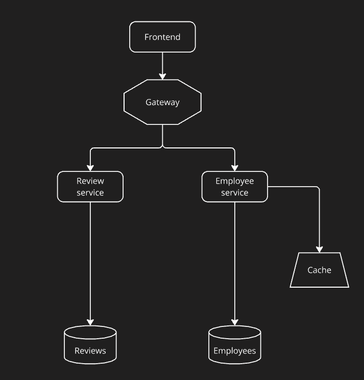

# Human Resource Information System (HRIS)

<details>
  <summary>Оглавление</summary>
  <ol>
    <li>
      <a href="#описание-проекта">Описание проекта</a>
      <ul>
        <li><a href="#стек">Стек</a></li>
        <li><a href="#общая-структура">Общая структура</a></li>
        <li><a href="#employee-service">Employee service</a></li>
        <li><a href="#review-service">Review service</a></li>
        <li><a href="#оптимизация">Оптимизация</a></li>
      </ul>
    </li>
    <li>
      <a href="#запуск">Запуск</a>
      <ul>
        <li><a href="#сборка-и-развертывание">Сборка и развертывание</a></li>
        <li><a href="#конфигурация">Конфигурация</a></li>
        <li><a href="#описание-env-файла">Описание .env файла</a></li>
      </ul>
    </li>
  </ol>
</details>

## Описание проекта

### Стек

- **Kotlin**
- **Ktor**
- **Kodein**
- **Exposed**
- **Docker**
- **Nginx**
- **Redis**
- **PostgreSQL**
- **Swagger**
- **Mockk**
- **Testcontainers**

### Общая структура

Данная система имеет микросервисную архитектуру и состоит из следующих компонентов:
1. **Nginx Gateway**
   - Сервис, через который происходит обращение в систему.
2. **Employee service**
    - Сервис, предоставляющий функционал для работы с информацией о сотрудниках и структуре иерархии компании.
    - Кэш для оптимизации работы с информацией о сотрудниках.
    - База данных для хранения инфрмации о сотрудниках.
3. **Review service**
   - Сервис, предоставляющий функционал для работы с обзорами эффективности.
   - База данных для хранения обзоров эффективности.



### Employee service
#### Сотрудники
 Данный серсив предоставляет API для работы с информацией о сотрудниках компании.
 Для хранение информации о сотрудниках используется база данных и кеш.
 Информация, хранящаяся в кеше определяется временм жизни записи [EMPLOYEE_REDIS_TTL](.env), которое обновляется при обращении к данной записи, а также механизмом очистки хранилища при переполнении по методу, который установлен в [redis.conf](redis/redis.conf)(volatile-lru).

##### API для работы с информацией о сорудниках

| Метод  | API                      | Описание                                                                               |
|--------|--------------------------|----------------------------------------------------------------------------------------|
| GET    | /employee/{id}           | Получение по `id` сорудника информации о нем                                           |
| POST   | employee                 | Создание нового сотрудника. Требует передачу информации о сотруднике в `body`          |
| PUT    | employee                 | Обновление существующего сотрудника. Требует передачу информации о сотруднике в `body` |
| DELETE | /employee/{id}           | Удаление сотрудника по `id`                                                            |

Пример `body`
```json
{
    "name": "name",
    "surname": "surname",
    "mail": "mail",
    "position": "position",
    "supervisorId": 1
}
```

#### Иерархия
 Также сервис предоставляет API для работы с информацией о структуре иерархии компании.
 Стандартная иерархия, которая выводится при входе сотрудника в систему, предоставляется по `GET /hierarchy/{id}`, включает в себя информацию о сотруднике, его начальнике и подчиненных.
 API иерархии предоставляют фронтенду возможность комбинациями запросов поэтапно построить дерево иерархии.
##### API для работы с информацией о структуре иерархии компании

| Метод   | API                          | Описание                                                                                                                  |
|---------|------------------------------|---------------------------------------------------------------------------------------------------------------------------|
| GET     | /hierarchy/{id}              | Получение по `id` сорудника дефолтной иерархии, которая включает информаию о сотруднике, его начальнике и его подчиненных |
| GET     | /hierarchy/equals/{id}       | Получение по `id` сорудника списка его коллег, которые стоят с ним на равном уровне иерархии                              |
| GET     | /hierarchy/subordinates/{id} | Получение по `id` сорудника списка его подчиненных                                                                        |
| GET     | /hierarchy/supervisor/{id}   | Получение по `id` сорудника информации о его начальнике                                                                   |
| GET     | /hierarchy/head/{id}         | Получение по `id` сорудника иерархии от него до главы компании                                                            |

#### Swagger
 Для получения развернутого описания API сервиса необходимо запустить сервис и обратиться к OpenAPI документации по `http://localhost:5000/swagger`.
 
**ВНИМАНИЕ**: Используется порт, указанный в [EMPLOYEE_SERVICE_PORT](.env)

### Review service
#### Обзоры эффективности
Данный серсив предоставляет API для работы с обзорами эффективности сотрудников.
Для хранение информации о сотрудниках используется база данных.

##### API для работы с обзорами эффективности

| Метод  | API                                                               | Описание                                                                                                          |
|--------|-------------------------------------------------------------------|-------------------------------------------------------------------------------------------------------------------|
| GET    | /review/{id}                                                      | Получение по `id` обзора эффективности                                                                            |
| GET    | /review/employee/{employee_id}                                    | Получение по `employee_id` списка обзров эффективности сотрудника                                                 |
| GET    | /review/employee/{employee_id}/before/{date}                      | Получение по `employee_id` списка обзров эффективности сотрудника до даты `date`                                  |
| GET    | /review/employee/{employee_id}/after/{date}                       | Получение по `employee_id` списка обзров эффективности сотрудника после даты `date`                               |
| GET    | /review/employee/{employee_id}/between/{date_after}/{date_before} | Получение по `employee_id` списка обзров эффективности сотрудника после даты `date_after` и до даты `date_before` |
| POST   | /review                                                           | Создание обзора эффективности. Требует передачу информации об обзоре в `body`                                     |
| PUT    | /review                                                           | Обновление обзора эффективности. Требует передачу информации об обзоре в `body`                                   |
| DELETE | /review/{id}                                                      | Удаление по `id` обзора эффективности                                                                             |

Пример `body`
```json
{
    "employee_id": 1,
    "performance": 1,
    "soft_skills": 1,
    "independence": 1,
    "aspiration_for_growth": 1
}
```
#### Swagger
Для получения развернутого описания API сервиса необходимо запустить сервис и обратиться к OpenAPI документации по `http://localhost:5001/swagger`.

**ВНИМАНИЕ**: Используется порт, указанный в [REVIEW_SERVICE_PORT](.env)

### Оптимизация
 #### База данных сотрудников
 При необходимости оптимизации работы базы данных сотрудников применить следующие меры:
 Проиндексировать поле `supervisor_id` в таблице сотрудников с использованием B-tree индекса
 ```postgresql
   CREATE INDEX index_supervisor_id
    ON employees(supervisor_id);
   ``` 

#### База данных обзоров эффективности
 При необходимости оптимизации работы базы обзоров эффективности применить следующие меры:
 Проиндексировать поля `employee_id` и `created_at` в таблице обзоров с использованием B-tree индекса
 ```postgresql
   CREATE INDEX index_employee_id_to_created_at
    ON reviews(employee_id, created_at);
   ``` 

 Организовать партиционирование таблицы обзоров. Каждый месяц создавать партицию, в которую будут помещаться новые обзоры, созданные за этот месяц.
 Также необходимо создать правило, которое будет записывать обзор в правильную партицию.
 В данном примере используется шаблон для автоматического создания партиций для года `year` и месяца `month`.
```postgresql
 CREATE TABLE reviews_y${year}m${month}
    CHECK ( created_at >= timestamp '${year}-${month}-01 00:00:00.000000' AND created_at < timestamp '${year}-${month}-01 00:00:00.000000' )
INHERITS (public.reviews);

CREATE RULE reviews_y${year}m${month} AS rule
   ON INSERT TO public.reviews WHERE
        ( created_at >= timestamp '${year}-${month}-01 00:00:00.000000' AND created_at < timestamp '${year}-${month}-01 00:00:00.000000' )
   DO INSTEAD
        INSERT INTO reviews_y${year}m${month} VALUES (NEW.*)
 ```

## Запуск

### Сборка и развертывание

 Для запуска проекта выполните шаги, описанные ниже.

1. Клонирование репозитория
   ```sh
   git clone https://github.com/deathsmilestome/HRIS.git
   ```
2. Compose up
   ```sh
   docker-compose up
   ```
   
### Конфигурация

- [Environment](.env)
- [Nginx](nginx/nginx.conf)
- [Redis](redis/redis.conf)

### Описание env файла

| Параметр                    | Занчение по дефолту                           | Описание                                                        |
|-----------------------------|-----------------------------------------------|-----------------------------------------------------------------|
| EMPLOYEE_SERVICE_HOST       | 0.0.0.0                                       | Хост employee-service                                           |
| EMPLOYEE_SERVICE_PORT       | 5000                                          | Порт employee-service                                           |
| EMPLOYEE_SERVICE_NAME       | employee-service                              | Наименование роута в employee-service для nginx                 |
| EMPLOYEE_DB_USER            | dstm                                          | Пользователь базы данных для employee-service                   |
| EMPLOYEE_DB_PASS            | dstm                                          | Пароль базы данных для employee-service                         |
| EMPLOYEE_DB_DRIVER          | org.postgresql.Driver                         | Драйвер базы данных для employee-service                        |
| EMPLOYEE_DB_URL             | jdbc:postgresql://db-employee:5432/employees  | Путь до базы данных для employee-service                        |
| EMPLOYEE_DB_NAME            | employees                                     | Имя базы данных для employee-service                            |
| EMPLOYEE_DB_PORT            | 5432                                          | Порт базы данных для employee-service                           |
| EMPLOYEE_REDIS_HOST         | redis-cache                                   | Хост базы данных для employee-service                           |
| EMPLOYEE_REDIS_PORT         | 6379                                          | Порт редиса для кеша                                            |
| EMPLOYEE_REDIS_TTL          | 10                                            | Время жизни записи в кеше                                       |
| REVIEW_SERVICE_HOST         | 0.0.0.0                                       | Хост review-service                                             |
| REVIEW_SERVICE_PORT         | 5001                                          | Порт review-service                                             |
| REVIEW_SERVICE_NAME         | review-service                                | Наименование роута в review-service для nginx                   |
| REVIEW_SERVICE_DATE_FORMAT  | dd-MM-yyyy-HH:mm                              | Формат даты для обзоров производительности                      |
| DATE_FORMAT_REVIEW_FILTER   | dd-MM-yyyy                                    | Формат даты для фильтра обзоров производительности при запросах |
| REVIEW_DB_USER              | dstm                                          | Пользователь базы данных для review-service                     |
| REVIEW_DB_PASS              | dstm                                          | Пароль базы данных для review-service                           |
| REVIEW_DB_DRIVER            | org.postgresql.Driver                         | Драйвер базы данных для review-service                          |
| REVIEW_DB_URL               | jdbc:postgresql://db-review:5432/reviews      | Путь до базы данных для review-service                          |
| REVIEW_DB_NAME              | reviews                                       | Имя базы данных для review-service                              |
| REVIEW_DB_PORT              | 5433                                          | Порт базы данных для review-service                             |
| NGINX_PORT                  | 80                                            | Порт для gateway                                                |
| LOG_LEVEL                   | INFO                                          | Уровень логирования                                             |